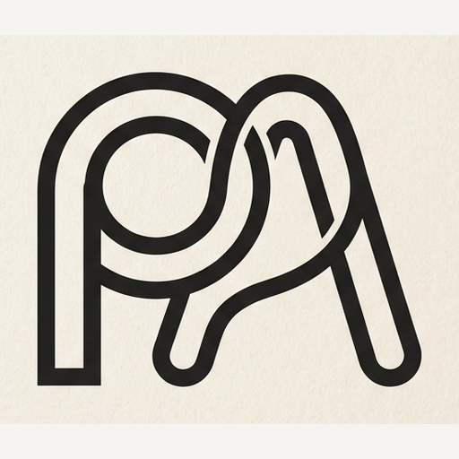
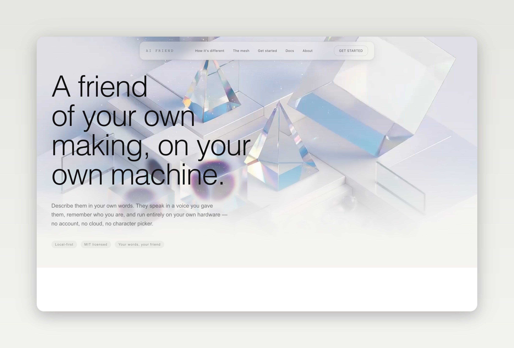

  

<h1 align="center">PALabs</h1>

PALabs is an experimental AI engineering lab focused on local-first,
personalized and autonomous intelligent systems.

## Projects

### AI Friend

A local-first AI companion built around persistent cognition, affect, memory,
voice, vision and user-authored identity.

  

[Explore AI Friend](https://github.com/PALabs-v1/AI_friend) — the public
website and docs live in a separate repo, [PALabs-v1/website](https://github.com/PALabs-v1/website).

## Principles

- Local-first where practical
- User-owned identity and data
- Measurable systems over AI demos
- Open engineering and reproducible research
- Human-centered personalized intelligence

Website: https://palabs.vercel.app/
